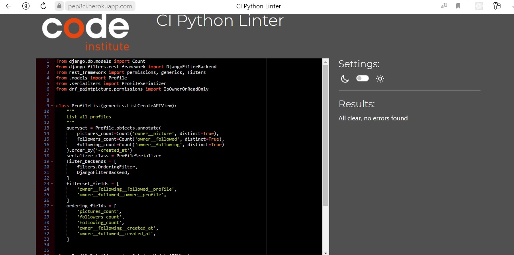
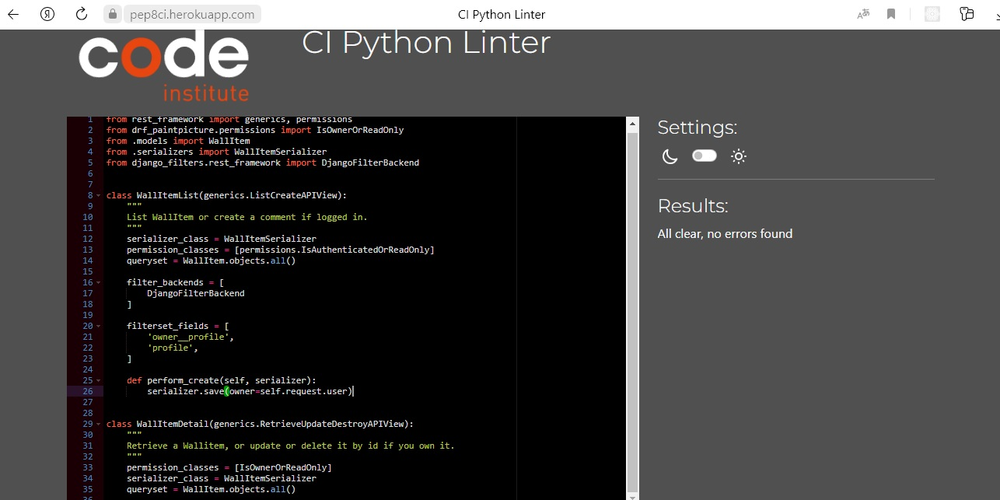
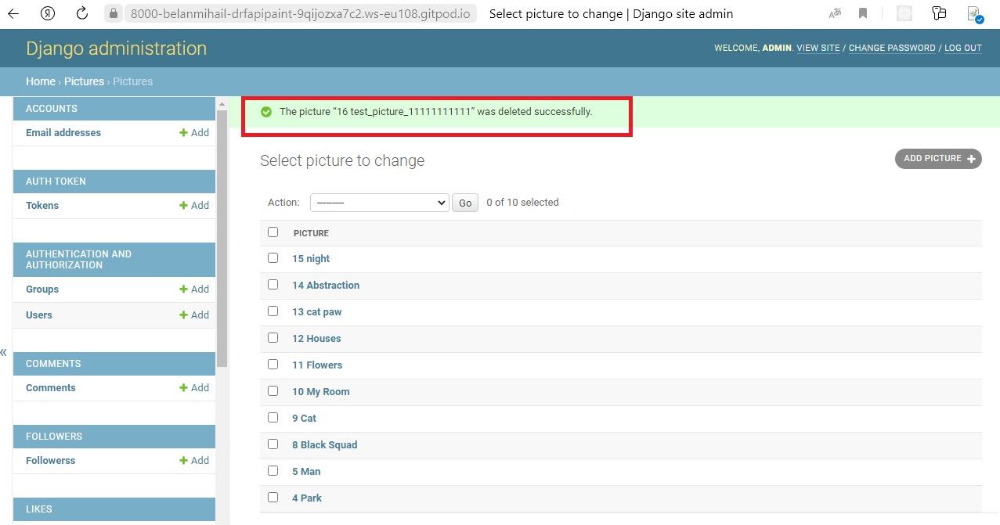
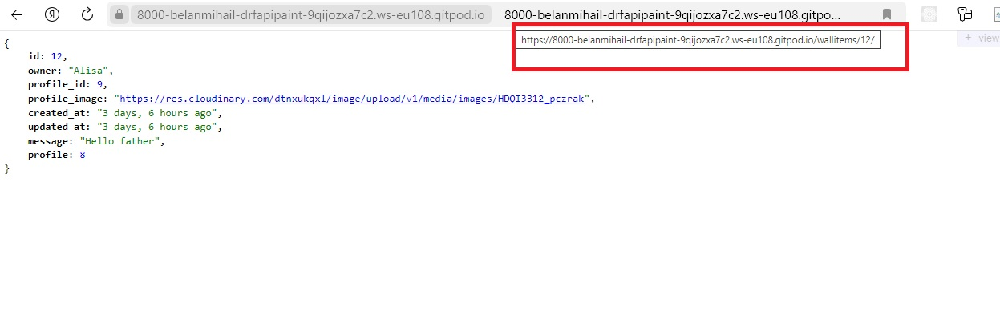

# DRF API PAINT PICTURE

**Developer: Bilan Mykhailo**

[Live link](https://paint-picture-backend-6b0b98f6459e.herokuapp.com/)

This repository contains the API set up using Django REST Framework for the Paint Picture front-end application ([repository here](https://github.com/Belan-Mihail/paint_picture) and [live website here](https://paint-picture-frontend-29a39ba64062.herokuapp.com/))

## Table of Contents
  - [User Stories](#user-stories)
  - [Database](#database)
       1. [User Model](#user-model)
       2. [Profile Model](#profile-model)
       3. [Picture Model](#picture-model)
       4. [Plan Model](#plan-model)
       5. [Comment Model](#comment-model)
       6. [Likes Model](#likes-model)
       7. [Followers Model](#followers-model)
  - [Technologies Used](#technologies-used)
      1. [Languages & Frameworks](#languages--frameworks)
  - [Agile](#agile)
  - [Validation](#validation)
      1. [Drf Paint Picture](#drf-paint-picture)
      1. [Profiles App](#profiles-app)
      2. [Pictures App](#pictures-app)
      3. [Plans App](#plans-app)
      4. [Comments App](#comments-app)
      5. [Likes App](#likes-app)
      6. [Followers App](#followers-app)
      7. [Wallitems App](#wallitems-app)
   - [Testing](#testing)
      1. [Manual Testing](#manual-testing)
      2. [Automated Testing](#automated-testing)
   - [Deployment](#deployment)
      1. [Creating ElephantSQL Database](#creating-elephantsql-database)
      2. [Workspace](#workspace)
      3. [Deployment on Heroku](#deployment-on-heroku)

## User Stories
The back-end section of the project focuses on its administration side and covers one user story:
- As an admin, I want to be able to create, edit and delete the users, pictures, comments, likes, followers, plans and wallitems, so that I can have a control over the content of the application and remove any potential inappropriate content.

## Database

The following models were created to represent the database model structure of the application:

### User Model

- The User model contains information about the user. It is part of the Django allauth library.
- One-to-one relation with the Profile model owner field
- ForeignKey relation with the Picture model owner
- ForeignKey relation with the Plan model owner
- ForeignKey relation with the Comment model owner
- ForeignKey relation with the Wallitem model owner
- ForeignKey relation with the Likes model owner
- ForeignKey relation with the Followers model owner

### Profile Model

- The model was created to create/delete profile for the user and to provide user with the ability to view, edit own profile on the site. this model contains the following fields

- owner
   - type: ForeignKey(User)
   - validation: on_delete=models.CASCADE

- created_at
   - type: DateTimeField
   - validation: auto_now_add=True

- updated_at
    - type: DateTimeField
    - validation: auto_now=True

- name
   - type: CharField
   - validation: max_length=255, blank=True 

- content
   - type: TextField
   - validation: blank=True 

- image
   - type: ImageField
   - upload_to='images/', default='../default_profile_rg7ho0'

- greeting
   - type: CharField
   - validation: max_length=25, blank=True

### Picture Model

- The model was created to provide the user with the ability to create, view, edit and delete pictures on the site. this model contains the following fields

- owner
   - type: ForeignKey(User)
   - validation: on_delete=models.CASCADE

- created_at
   - type: DateTimeField
   - validation: auto_now_add=True

- updated_at
    - type: DateTimeField
    - validation: auto_now=True

- title
   - type: CharField
   - validation: max_length=255 

- description
   - type: TextField
   - validation: blank=True 

- image
   - type: ImageField
   - validation: upload_to='images/', default='../default_post_x6zdvo', blank=True

- picture_category
   - type: CharField
   - validation: max_length=32, choices=category_choices, default='other' 

- Following categories choices were added for user to select for an pictures:

category_choices = 
            ('landscapes', 'landscapes'),
            ('animals', 'animals'),
            ('plants', 'plants'),
            ('abstraction', 'abstraction'),
            ('other', 'other'),
        

### Plan Model

- The model was created to provide the user with the ability to create, view, edit and delete plans on the site. this model contains the following fields

- owner
   - type: ForeignKey(User)
   - validation: on_delete=models.CASCADE, related_name="plan_owner"

- created_at
   - type: DateTimeField
   - validation: auto_now_add=True

- updated_at
    - type: DateTimeField
    - validation: auto_now=True

- plans_title
   - type: CharField
   - validation: max_length=255, blank=False

- plans_description
   - type: TextField
   - validation: max_length=300, blank=False 

- plans_date
   - type: DateField
   - validation: -

- until
   - type: BooleanField
   - validation: default=False 

### Comment Model

- The model was created to provide the user with the ability to create, view, edit and delete comments on the site. this model contains the following fields

- owner
   - type: ForeignKey(User)
   - validation: on_delete=models.CASCADE 

- picture
   - type: ForeignKey(Picture)
   - validation: on_delete=models.CASCADE 

- created_at
   - type: DateTimeField
   - validation: auto_now_add=True

- updated_at
    - type: DateTimeField
    - validation: auto_now=True

- content
   - type: TextField
   - validation: - 

### WallItem Model

- The model was created to provide the user with the ability to create, view, edit and delete wallitem on the site. this model contains the following fields

- owner
   - type: ForeignKey(User)
   - validation: on_delete=models.CASCADE,
   related_name="wallitem_owner" 

- profile
   - type: ForeignKey(Profile)
   - validation: on_delete=models.CASCADE, blank=True, null=True 

- created_at
   - type: DateTimeField
   - validation: auto_now_add=True

- updated_at
    - type: DateTimeField
    - validation: auto_now=True

- message
   - type: TextField
   - validation: blank=False, null=False

### Likes Model

- The model was created to provide the user with the ability to create, view and delete likes on the site. this model contains the following fields

- owner
   - type: ForeignKey(User)
   - validation: on_delete=models.CASCADE,
   

- picture
   - type: ForeignKey(Picture)
   - validation: on_delete=models.CASCADE

- created_at
   - type: DateTimeField
   - validation: auto_now_add=True

### Followers Model

- The model was created to provide the user with the ability to use followers functionality. this model contains the following fields

- owner
   - type: ForeignKey(User)
   - validation: on_delete=models.CASCADE,
    related_name='following'
   

- followed
   - type: ForeignKey(User)
   - validation: on_delete=models.CASCADE, related_name='followed'

- created_at
   - type: DateTimeField
   - validation: auto_now_add=True

## Technologies Used

### Languages & Frameworks

- Python
- Django

### Libraries & Tools

- [Django REST Framework](https://www.django-rest-framework.org/) was used this to build the back-end API
- [Django AllAuth](https://django-allauth.readthedocs.io/en/latest/index.html) was used for user authentication
- [Git](https://git-scm.com/) was used this for version control and to push the code to GitHub
- [GitHub](https://github.com/) was used this as a remote repository to store project code
- [Cloudinary](https://cloudinary.com/) was used to store default images for profiles and pictures
- [Gitpod](https://gitpod.io/workspaces) was used this to host a virtual workspace
- [Heroku](https://heroku.com) was used this was used to deploy the project into live environment
- [ElephantSQL](https://www.elephantsql.com/) was used as the deployed project on Heroku uses an ElephantSQL database
- [CI Python Linter](https://pep8ci.herokuapp.com/) was used for validation of python files.
- [Psycopg2](https://www.psycopg.org/docs/) was used as a PostgreSQL database adapter for Python
- [Pillow](https://pillow.readthedocs.io/en/stable/) was used for image processing and validation
- [Paint](https://getpaint.net/) was used for create default avatar and pictures image

## Agile 

- create Issue Template
   

Issue template

   
   

- create Milestones
   

Milestones

   
   

- create project [Link to project](https://github.com/users/Belan-Mihail/projects/7)
- create issues (based on the template). A total of 48 issues were created
   

Issues

   
   

- create main labels and mark issues in accordance with Moscow Prioritisation
   

Labels

   
   

- create Kanban Board to visualize the process of completing tasks
   

Kanban Board

   
   

This project was the second time I used agile development methods. The importance of these principles is beyond doubt. There may have been certain inaccuracies in the use of all the principles of this methodology.

## Validation

### Drf Paint Picture

Views

Serializers

Urls

Permissions

### Profiles App

Models

Views

Serializers

Urls

Admin

Tests

### Pictures App

Models

Views

Serializers

Urls

Admin

Tests

### Plans App

Models

Views

Serializers

Urls

Admin

Tests

### Comments App

Models

Views

Serializers

Urls

Admin

Tests

### Likes App

Models

Views

Serializers

Urls

Admin

Tests

### Followers App

Models

Views

Serializers

Urls

Admin

Tests

### Wallitems App

Models

Views

Serializers

Urls

Admin

Tests

## Testing

The following tests were carried out on the app:
1. Manual testing
2. Automated testing

### Manual testing 

- As an admin, I want to be able to create, edit and delete the users, pictures, comments, plans, wallitems, followers and likes, so that I can have a control over the content of the application and remove any potential inappropriate content

**Test Model** | **Action** | **Expected Result** | **Actual Result**
-------- | ------------------- | ------------------- | -----------------
User | Create, update, delete user and change permissions | A user can be created, edited or deleted and User permissions can be updated | Works as expected

Screenshots

    

Create user

    
     
    

    

Update user

    
     
    

    

Change permission

    
     
    

    

Delete user

    
     
    

**Test** | **Action** | **Expected Result** | **Actual Result**
-------- | ------------------- | ------------------- | -----------------
Profile | Create (automatically when creating a user), update & delete | User profile can be created, edited or deleted | Works as expected

Screenshots

    

Create profile (automatically when creating a user)

    
    
     
    

    

Update profile

    
     
    

    

Delete profile

    
     
    

**Test** | **Action** | **Expected Result** | **Actual Result**
-------- | ------------------- | ------------------- | -----------------
Profile |  Add "/profiles" in url | Can see profile list | Works as expected

Screenshots

    

Profile list

    
     
    

**Test** | **Action** | **Expected Result** | **Actual Result**
-------- | ------------------- | ------------------- | -----------------
Profile |  Add "/profiles/id" in url | Can see profile detail | Works as expected

Screenshots

    

Profile Detail

    
     
    

**Test** | **Action** | **Expected Result** | **Actual Result**
-------- | ------------------- | ------------------- | -----------------
Picture | Create, update & delete | Picture can be created, edited or deleted | Works as expected

Screenshots

    

Create picture

    
     
    

    

Update picture

    
     
    

    

Delete picture

    
     
    

**Test** | **Action** | **Expected Result** | **Actual Result**
-------- | ------------------- | ------------------- | -----------------
Picture |  Add "/pictures" in url | Can see picture list | Works as expected

Screenshots

    

Picture list

    
     
    

**Test** | **Action** | **Expected Result** | **Actual Result**
-------- | ------------------- | ------------------- | -----------------
Picture |  Add "/pictures/id" in url | Can see picture detail | Works as expected

Screenshots

    

Picture Detail

    
     
    

**Test** | **Action** | **Expected Result** | **Actual Result**
-------- | ------------------- | ------------------- | -----------------
Comment | Create, update & delete comment | Comment can be created, edited or deleted | Works as expected

Screenshots

    

Create comment

    
     
    

    

Update comment

    
     
    

    

Delete comment

    
     
    

**Test** | **Action** | **Expected Result** | **Actual Result**
-------- | ------------------- | ------------------- | -----------------
Comment |  Add "/comments" in url | Can see comment list | Works as expected

Screenshots

    

Comment list

    
     
    

**Test** | **Action** | **Expected Result** | **Actual Result**
-------- | ------------------- | ------------------- | -----------------
Comment |  Add "/comments/id" in url | Can see comment detail | Works as expected

Screenshots

    

Comment Detail

    
     
    

**Test** | **Action** | **Expected Result** | **Actual Result**
-------- | ------------------- | ------------------- | -----------------
Plan | Create, update & delete plan | Plan can be created, edited or deleted | Works as expected

Screenshots

    

Create plan

    
     
    

    

Update plan

    
     
    

    

Delete plan

    
     
    

**Test** | **Action** | **Expected Result** | **Actual Result**
-------- | ------------------- | ------------------- | -----------------
Plan |  Add "/plans" in url | Can see plan list | Works as expected

Screenshots

    

Plan list

    
     
    

**Test** | **Action** | **Expected Result** | **Actual Result**
-------- | ------------------- | ------------------- | -----------------
Plan |  Add "/plans/id" in url | Can see plan detail | Works as expected

Screenshots

    

Plan Detail

    
     
    

**Test** | **Action** | **Expected Result** | **Actual Result**
-------- | ------------------- | ------------------- | -----------------
Wallitem | Create, update & delete wallitem | Wallitem can be created, edited or deleted | Works as expected

Screenshots

    

Create wallitem

    
     
    

    

Update wallitem

    
     
    

    

Delete wallitem

    
     
    

**Test** | **Action** | **Expected Result** | **Actual Result**
-------- | ------------------- | ------------------- | -----------------
Wallitem |  Add "/wallitems" in url | Can see wallitem list | Works as expected

Screenshots

    

Wallitem list

    
     
    

**Test** | **Action** | **Expected Result** | **Actual Result**
-------- | ------------------- | ------------------- | -----------------
Wallitem |  Add "/wallitems/id" in url | Can see wallitem detail | Works as expected

Screenshots

    

Wallitem Detail

    
     
    

**Test** | **Action** | **Expected Result** | **Actual Result**
-------- | ------------------- | ------------------- | -----------------
Likes | Create & delete like | Like can be created or deleted | Works as expected

Screenshots

    

Create like

    
     
    

    

Delete like

    
     
    

**Test** | **Action** | **Expected Result** | **Actual Result**
-------- | ------------------- | ------------------- | -----------------
Likes |  Add "/likes" in url | Can see like list | Works as expected

Screenshots

    

Like list

    
     
    

**Test** | **Action** | **Expected Result** | **Actual Result**
-------- | ------------------- | ------------------- | -----------------
Likes |  Add "/likes/id" in url | Can see like detail | Works as expected

Screenshots

    

Like Detail

    
     
    

**Test** | **Action** | **Expected Result** | **Actual Result**
-------- | ------------------- | ------------------- | -----------------
Followers | Create & delete follower | Follower can be created or deleted | Works as expected

Screenshots

    

Create follower

    
     
    

    

Delete follower

    
     
    

**Test** | **Action** | **Expected Result** | **Actual Result**
-------- | ------------------- | ------------------- | -----------------
Followers |  Add "/followers" in url | Can see follower list | Works as expected

Screenshots

    

Follower list

    
     
    

**Test** | **Action** | **Expected Result** | **Actual Result**
-------- | ------------------- | ------------------- | -----------------
Followers |  Add "/followers/id" in url | Can see follower detail | Works as expected

Screenshots

    

Follower Detail

    
     
    

### Automated testing

- Automated testing was done using the Django Rest Framework APITestCase.

- Coverage report for project was done and overall result was 97%

Test Report

## Deployment

### Creating ElephantSQL Database 

1. Go to [ElephantSQL](https://customer.elephantsql.com/) and sign up or sign in to your account. Then click on the 'Create New Instance' button.
2. Add your database name, select payment plan ('Tiny Turtle'). Then, click on 'Select Region' and choose you region. Then create the database instance.
3. Click on the name of the database you created and copy database URL

### Workspace
1. Create Procfile (!important with capital P) with:
   - release: python manage.py makemigrations && python manage.py migrate
   - web: gunicorn YOUR_PROJECT_NAME.wsgi
2. Update Requirements.txt file with data of libraries used for project
3. Create env.py with confidential data eg. API keys, passwords, database and cloudinary urls.

### Deployment on Heroku

1. Go to [Heroku](https://heroku.com/). Login or create an account at Heroku
2. Click "create new app" button
3. Add an app name
4. Select region
5. Click "create app" button
6. Open settings Tab and click on "reveal config var" button
7. Add required configurations (key/value):
   - key: ALLOWED_HOST; value: your heroku app name(drf api) with .herokuapp.com
   - key: CLIENT_ORIGIN; value:  URL adress you demployment frontend app
   - key: CLIENT_ORIGIN_DEV; value: Workspace host your frontend app
   - key: CLOUDINARY_URL; value: your CLOUDINARY url adress
   - key: DATABASE_URL; value: database URL  
   - key: SECRET_KEY; value: your project secret key.
8. Open Deploy Tab and choose GITHUB deployment method 
9. Choose repositories you want to connect and click "connect" button
10. Then click "Deploy Branch" button

